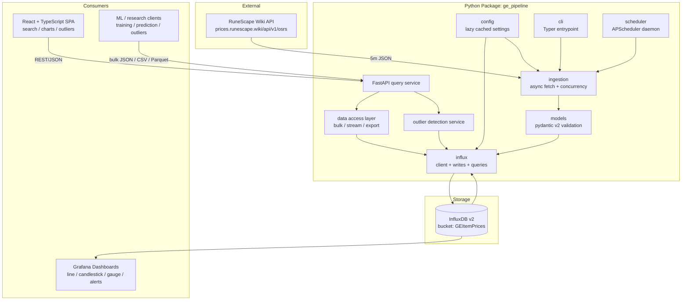
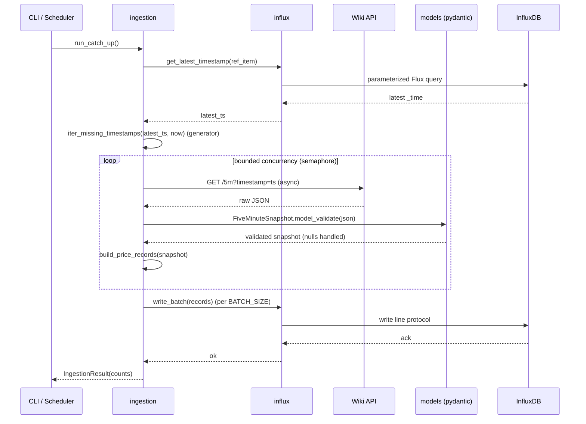
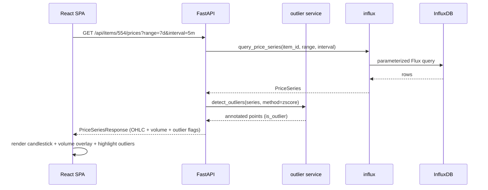
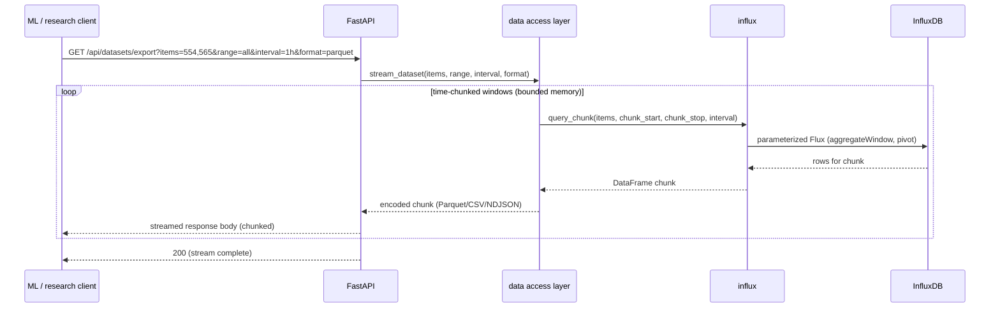

# Design Document: Modernization and Dashboard

## Overview

This feature modernizes the OSRS Grand Exchange price collection pipeline and adds
two complementary front ends for visualizing and detecting price outliers. The
backend work removes structural anti-patterns (import-time side effects, serial
synchronous ingestion, unvalidated API JSON, eager timestamp materialization) and
introduces schema validation, async ingestion with bounded concurrency, a proper
Python package with a CLI, automated scheduling, and a test suite with
property-based tests. This spec also re-applies and verifies the foundational
code-quality improvements (env-var config, retry with exponential backoff, batched
writes, logging, type hints, docstrings) as part of the modernized package layout —
rather than treating them as external — so the whole backend lands as one coherent,
tested unit. See **Foundational Code Quality** below for the specifics carried into
this design.

A primary design goal is **large-scale data access**. The InfluxDB store already
holds hundreds of thousands of 5-minute snapshots per item since 2021, and the user
intends to run ML training/prediction and additional outlier-detection algorithms on
it. The query layer and API are therefore designed for bulk, multi-item, streaming,
and export-oriented reads (not just single-item chart queries), with downsampling,
chunking, pagination, and ML-friendly output formats (JSON, CSV, Parquet).

On top of the modernized backend, two UI paths are documented so the user can pick
either or run both. The first is **Grafana on InfluxDB**, a fast low-code path using
Grafana's native Flux/InfluxDB data source with line, candlestick, and gauge panels
plus alerting. The second is a **custom FastAPI + React/TypeScript web app** that
exposes query endpoints over the existing InfluxDB data and renders a tailored OSRS
GE experience: item search, price/volume overlays, candlestick charts, and
server-computed outlier highlighting on a dark theme.

## Foundational Code Quality (carried into this spec)

These improvements are (re)applied and validated within the modernized `ge_pipeline`
package rather than assumed complete elsewhere:

- **Env-var configuration** via `get_settings()` (python-dotenv), no hardcoded secrets.
- **Retry with exponential backoff** for transient network/DB failures
  (`TransientError` / `NonTransientError`).
- **Batched writes** (`batch_size`, default 50) to amortize round-trips.
- **Structured logging** through the `logging` module at all layers.
- **Type hints and docstrings** on all public functions (PEP 8, snake_case).
- **Package layout + pinned deps** via `pyproject.toml`; dead/duplicate files removed.

They are folded into the components and tested by the same suite described in
**Testing Strategy**, so the code-quality baseline is guaranteed by CI rather than by
convention.

The design is split into two parts. **Part A — High-Level Design** covers system
architecture, component boundaries, sequence flows, and data models. **Part B —
Low-Level Design** covers concrete interfaces, function signatures, algorithms in
Python/TypeScript, formal specifications (preconditions, postconditions, loop
invariants), and correctness properties suitable for property-based testing.

---

# Part A — High-Level Design

## Architecture

The system separates ingestion, storage, query serving, and presentation into
distinct layers. InfluxDB v2 remains the single source of truth. Both UIs read from
the same store; Grafana reads InfluxDB directly, while the React app reads through
the FastAPI query layer.



### Layer responsibilities

- **config** — Lazily loads and caches settings from environment/`.env`. No work at
  import time. Shared by every other module.
- **models** — pydantic v2 models validate and coerce raw Wiki API JSON, centralize
  null handling, and produce clean domain objects.
- **ingestion** — Async fetch of 5-minute snapshots with bounded concurrency and
  rate-limit respect; transforms validated data into InfluxDB records; batches writes.
- **influx** — Owns the InfluxDB client lifecycle, batched writes, and parameterized
  Flux queries. Reused by ingestion and the data access layer.
- **data access layer** — Bulk/streaming/export reads built for scale: multi-item
  queries, server-side downsampling via `aggregateWindow`, time-chunked pagination,
  and ML-friendly output (JSON, CSV, Parquet). This is the layer future ML/research
  code and the API both call.
- **cli** — Typer app exposing `ingest`, `backfill`, `setup`, `serve`, and `export`
  commands.
- **scheduler** — APScheduler-based daemon that triggers catch-up ingestion every 5
  minutes; deployable via systemd.
- **api** — FastAPI service exposing read endpoints for items, price series,
  outliers, and bulk/ML dataset export, consumed by the React SPA and research clients.
- **outlier detection** — Pluggable server-side statistical detection (rolling
  z-score / IQR today, extensible to more algorithms) used by the API and available
  for Grafana via computed fields.

## Sequence Diagrams

### Async catch-up ingestion



### React app price + outlier request



### Bulk / ML dataset export (streaming)



## Components and Interfaces

### Component: config

**Purpose**: Provide validated, cached application settings without import-time side
effects.

**Interface**:
```python
class Settings:
    influx_url: str
    influx_token: str
    influx_org: str
    influx_bucket: str
    user_agent: str
    api_base_url: str
    max_concurrency: int
    batch_size: int

def get_settings() -> Settings: ...  # cached; loads .env on first call only
```

**Responsibilities**:
- Load `.env`/environment on first access, then cache.
- Raise a clear error only when settings are actually needed, never at import.

### Component: models (pydantic v2)

**Purpose**: Validate and coerce raw Wiki API JSON; centralize null handling.

**Interface**:
```python
class ItemPricePoint(BaseModel):    # one item within a snapshot
    avg_high_price: int | None
    avg_low_price: int | None
    high_price_volume: int | None
    low_price_volume: int | None

class FiveMinuteSnapshot(BaseModel):  # full /5m response
    timestamp: int
    data: dict[str, ItemPricePoint]
```

**Responsibilities**:
- Reject malformed responses early with descriptive validation errors.
- Coerce field aliases from the API (`avgHighPrice` → `avg_high_price`).
- Preserve `None` for inactive items so downstream filtering is centralized.

### Component: influx

**Purpose**: Own InfluxDB client, batched writes, and parameterized queries.

**Interface**:
```python
def get_client(settings: Settings) -> InfluxDBClient: ...
def write_batch(client, bucket, records: list[dict]) -> None: ...
def get_latest_timestamp(client, item_id: str) -> int | None: ...
def query_price_series(client, item_id, start, stop, interval) -> PriceSeries: ...
def query_chunk(client, item_ids: list[str], start, stop, interval) -> pd.DataFrame: ...
def list_item_ids(client) -> list[str]: ...
```

**Responsibilities**:
- Reuse a single client across operations (per steering rules).
- Use parameterized Flux queries only (no string interpolation of user values).
- Support multi-item queries and server-side `aggregateWindow` downsampling.

### Component: data access layer

**Purpose**: Provide scale-oriented reads for the API, ML training/prediction, and
research — the single place that knows how to page, downsample, and encode large
result sets.

**Interface**:
```python
def iter_time_chunks(start: int, stop: int, chunk_seconds: int) -> Iterator[tuple[int, int]]: ...

def stream_dataset(
    client, item_ids: list[str], start: int, stop: int,
    interval: str, fmt: Literal["ndjson", "csv", "parquet"],
) -> Iterator[bytes]: ...

def get_price_page(
    client, item_id: str, start: int, stop: int,
    interval: str, cursor: int | None, limit: int,
) -> PricePage: ...

def build_feature_frame(
    client, item_ids: list[str], start: int, stop: int, interval: str,
) -> pd.DataFrame: ...   # tidy, ML-ready frame (time-indexed, per-item columns)
```

**Responsibilities**:
- Chunk long ranges by time to bound memory (never materialize "all since 2021").
- Downsample via `interval` (`aggregateWindow`) so ML clients choose resolution.
- Emit ML-friendly formats: NDJSON (streaming), CSV, and Parquet (columnar).
- Provide cursor-based pagination for interactive/large reads.

### Component: outlier detection (pluggable)

**Purpose**: Flag anomalous price points server-side with swappable algorithms so
future detectors can be added without touching the API.

**Interface**:
```python
class OutlierDetector(Protocol):
    def detect(self, values: list[float | None]) -> list[bool]: ...

def get_detector(method: str, **params) -> OutlierDetector: ...  # registry lookup
# built-in: "zscore", "iqr"; future: "mad", "isolation_forest", "prophet_residual"
```

**Responsibilities**:
- Registry pattern: register detectors by name so new algorithms plug in cleanly.
- Uniform `list[bool]` output aligned to input length (None-safe).

### Component: ingestion

**Purpose**: Async catch-up ingestion with bounded concurrency and rate-limiting.

**Interface**:
```python
def iter_missing_timestamps(latest: int | None, now: int) -> Iterator[int]: ...
async def fetch_snapshot(client: httpx.AsyncClient, ts: int) -> FiveMinuteSnapshot: ...
def build_price_records(snapshot: FiveMinuteSnapshot) -> list[dict]: ...
async def run_catch_up(settings: Settings) -> IngestionResult: ...
```

**Responsibilities**:
- Generate missing timestamps lazily (no full-array materialization).
- Respect a concurrency limit and back off on HTTP 429/5xx.

### Component: api (FastAPI)

**Purpose**: Expose read endpoints for the React SPA.

**Interface (routes)**:
```
GET  /api/health
GET  /api/items?query={substr}                    -> item search
GET  /api/items/{item_id}/prices?range&interval    -> OHLC + volume + outlier flags
GET  /api/items/{item_id}/prices/page?cursor&limit -> cursor-paginated points
GET  /api/items/{item_id}/outliers?range&method    -> outlier points only
GET  /api/datasets/export?items&range&interval&format -> streamed bulk export (ML)
GET  /api/datasets/features?items&range&interval   -> ML-ready feature frame (JSON/Parquet)
GET  /api/outlier-methods                          -> list available detector names
```

**Responsibilities**:
- Validate query params, delegate to influx, data access, and outlier services.
- Return typed JSON matching the React app's TypeScript interfaces.
- Stream large exports (chunked transfer) instead of buffering full result sets.
- Enforce sane limits (max items per request, max range without downsampling).

### Component: React + TypeScript SPA

**Purpose**: Tailored OSRS GE visualization with a dark theme.

**Key modules**:
- `api/client.ts` — typed fetch wrappers for the FastAPI routes.
- `components/ItemSearch.tsx` — debounced search box.
- `components/PriceChart.tsx` — candlestick + volume overlay (Lightweight Charts).
- `components/OutlierBadge.tsx` — highlights flagged points.
- `hooks/usePriceSeries.ts` — data fetching + caching.

## Data Models

### Domain model: ItemPricePoint

```python
class ItemPricePoint(BaseModel):
    avg_high_price: int | None = Field(default=None, alias="avgHighPrice")
    avg_low_price: int | None = Field(default=None, alias="avgLowPrice")
    high_price_volume: int | None = Field(default=None, alias="highPriceVolume")
    low_price_volume: int | None = Field(default=None, alias="lowPriceVolume")
```

**Validation rules**:
- All fields optional; `None` allowed (inactive items).
- Non-null numeric fields must be `>= 0`.
- Unknown keys ignored (forward-compatible with API additions).

### Storage model (unchanged InfluxDB schema)

| Element | Value |
|---|---|
| Measurement | `itemPrice` |
| Tag | `itemID` (string) |
| Fields | `avgHighPrice`, `avgLowPrice`, `highPriceVolume`, `lowPriceVolume` |
| Write precision | seconds |
| Granularity | 5 minutes |
| Bucket / Org | `GEItemPrices` / `Ge-data-project` |

### API/UI transport model (TypeScript)

```typescript
interface PricePoint {
  time: number;            // unix seconds
  avgHighPrice: number | null;
  avgLowPrice: number | null;
  highPriceVolume: number | null;
  lowPriceVolume: number | null;
  isOutlier: boolean;
}

interface PriceSeriesResponse {
  itemId: string;
  interval: string;        // e.g. "5m", "1h"
  points: PricePoint[];
}

interface ItemSearchResult {
  itemId: string;
  name: string;
}

interface PricePage {
  itemId: string;
  interval: string;
  points: PricePoint[];
  nextCursor: number | null;   // null when no more pages
}

type ExportFormat = "ndjson" | "csv" | "parquet";
```

**Validation rules**:
- `time` strictly increasing across `points`.
- `interval` is one of the allowed enum values.
- `isOutlier` always present (defaults to `false`).

## Error Handling

### Scenario: Missing configuration at runtime
**Condition**: A required env var is unset when settings are first accessed.
**Response**: `get_settings()` raises a descriptive `ConfigError` naming the variable.
**Recovery**: CLI prints remediation (`cp .env.example .env`) and exits non-zero.

### Scenario: Transient Wiki API failure (timeout / 5xx / 429)
**Condition**: Network error, server error, or rate limit during fetch.
**Response**: Retry with exponential backoff (reuse existing retry pattern); honor
`Retry-After` on 429.
**Recovery**: After max retries, log and skip that timestamp; ingestion continues.

### Scenario: Malformed API JSON
**Condition**: Response fails pydantic validation.
**Response**: Log the validation error with the offending timestamp; skip snapshot.
**Recovery**: Ingestion proceeds; no partial/corrupt records are written.

### Scenario: InfluxDB write failure
**Condition**: Write API raises `ApiException`/`OSError`.
**Response**: Retry on transient; on final failure log and drop the batch.
**Recovery**: Next scheduled run re-detects the gap and backfills.

### Scenario: API query for unknown item
**Condition**: React app requests an item with no data.
**Response**: FastAPI returns `404` with a typed error body.
**Recovery**: SPA shows an empty-state message.

## Testing Strategy

### Unit testing
- `pytest` for config loading, record building, outlier math, and query builders.
- Mock `httpx` responses; mock InfluxDB client for write/query logic.

### Property-based testing
- **Library**: Hypothesis (Python).
- Focus areas: `build_price_records` null-filtering invariants,
  `iter_missing_timestamps` generator correctness, `iter_time_chunks` partitioning,
  `get_price_page` lossless pagination, `stream_dataset` round-trip, and outlier
  detector length/None-safety across all registered methods.
- See **Correctness Properties** in Part B for the exact universally-quantified
  statements to encode as Hypothesis tests.

### Integration testing
- Spin up an InfluxDB test container; round-trip write → query.
- FastAPI `TestClient` for endpoint contract tests against a seeded store.

## Performance Considerations

- Async ingestion with a bounded semaphore (default `MAX_CONCURRENCY = 8`) turns a
  multi-hour serial backfill (~hundreds of thousands of 5-minute windows since 2021)
  into a concurrent, rate-limit-respecting operation.
- Generator-based timestamp iteration keeps memory flat regardless of range size.
- Batched writes (reuse `BATCH_SIZE = 50`) amortize network round-trips.
- **Large-scale reads (ML goal)**: the data access layer chunks long ranges by time
  (`iter_time_chunks`) and streams encoded chunks, so exporting years of multi-item
  data never loads the full result set into memory.
- API queries use InfluxDB `aggregateWindow` to downsample server-side; ML clients
  pick resolution via `interval` (e.g. `5m` raw for detail, `1h`/`1d` for training).
- Parquet export gives columnar, compressed datasets suited to pandas/Polars/Arrow
  ingestion for model training.
- Guardrails: max items per request and a max raw (un-downsampled) range prevent
  accidental full-store scans; exceeding them requires an explicit `interval`.

## Security Considerations

- No secrets in source; all config via env/`.env` (already `.gitignore`d).
- FastAPI: input validation on all query params; CORS restricted to the SPA origin.
- **Note**: The FastAPI query service and Grafana both expose data over the network.
  This design does not add authentication to the FastAPI endpoints by default — for
  a local single-user setup this may be acceptable, but if the service is exposed
  beyond localhost, an auth layer (API key or reverse-proxy auth) should be added.
  Grafana should retain its built-in login.
- Parameterized Flux queries prevent injection through item IDs / ranges.

## Dependencies

- **Existing**: `influxdb-client`, `pandas`, `python-dotenv` (pinned).
- **New (backend)**: `httpx` (async HTTP), `pydantic>=2`, `typer` (CLI),
  `apscheduler` (scheduling), `fastapi`, `uvicorn`, `pytest`, `hypothesis`,
  `pyarrow` (Parquet export for ML datasets).
- **New (frontend)**: `react`, `typescript`, `vite`, a charting lib
  (Lightweight Charts for candlesticks; Recharts/ECharts acceptable alternatives).
- **External services**: InfluxDB v2 at `localhost:8086`; optional Grafana instance.
- All Python deps pinned in `pyproject.toml`; JS deps pinned in `package-lock.json`.

---

# Part B — Low-Level Design

## Core Interfaces/Types

```python
from collections.abc import Iterator
from dataclasses import dataclass
from pydantic import BaseModel, Field


@dataclass(frozen=True)
class Settings:
    influx_url: str
    influx_token: str
    influx_org: str
    influx_bucket: str
    user_agent: str = "GEoutlier-detection"
    api_base_url: str = "https://prices.runescape.wiki/api/v1/osrs"
    max_concurrency: int = 8
    batch_size: int = 50


class ItemPricePoint(BaseModel):
    avg_high_price: int | None = Field(default=None, alias="avgHighPrice", ge=0)
    avg_low_price: int | None = Field(default=None, alias="avgLowPrice", ge=0)
    high_price_volume: int | None = Field(default=None, alias="highPriceVolume", ge=0)
    low_price_volume: int | None = Field(default=None, alias="lowPriceVolume", ge=0)

    model_config = {"populate_by_name": True, "extra": "ignore"}


class FiveMinuteSnapshot(BaseModel):
    timestamp: int
    data: dict[str, ItemPricePoint]


@dataclass
class IngestionResult:
    timestamps_processed: int
    records_written: int
    timestamps_skipped: int
    failures: int
```

## Key Functions with Formal Specifications

### Function: get_settings()

```python
def get_settings() -> Settings
```

**Preconditions:**
- Environment variables `INFLUX_URL`, `INFLUX_TOKEN`, `INFLUX_ORG`,
  `INFLUX_BUCKET` are set and non-empty *at the time of first call*.

**Postconditions:**
- Returns a fully-populated `Settings`.
- The result is cached: repeated calls return the identical object and do not
  re-read the environment.
- Raises `ConfigError` naming the first missing variable if a required value is
  absent. No exception is raised merely by importing the module.

**Loop invariants:** N/A.

### Function: iter_missing_timestamps()

```python
def iter_missing_timestamps(
    latest: int | None,
    now: int,
    interval: int = 300,
    earliest: int = 1615733100,
) -> Iterator[int]
```

**Preconditions:**
- `now >= earliest`.
- `interval > 0`.
- `latest` is either `None` or a value `>= earliest`.

**Postconditions:**
- Yields strictly increasing timestamps aligned to `interval`.
- Every yielded value `t` satisfies `start <= t < now`, where
  `start = earliest` if `latest is None` else `latest + interval`.
- Consecutive yielded values differ by exactly `interval`.
- Lazy: at most one timestamp is held in memory at a time (generator).

**Loop invariants:**
- Before yielding value `t_k`: all previously yielded values are `< t_k` and
  `>= start`.

### Function: build_price_records()

```python
def build_price_records(snapshot: FiveMinuteSnapshot) -> list[dict]
```

**Preconditions:**
- `snapshot` is a validated `FiveMinuteSnapshot`.

**Postconditions:**
- Returns one record per item that has at least one non-null price field.
- Items whose every field is `None` are excluded (centralized null filtering).
- Each returned record has `measurement == "itemPrice"`,
  `tags == {"itemID": <str>}`, `time == snapshot.timestamp`, and a non-empty
  `fields` dict containing only non-null values.
- No record contains a field whose value is `None`.

**Loop invariants:**
- After processing item `i`: `records` contains exactly the items among the first
  `i` that had ≥1 non-null field, and no record in `records` has an empty
  `fields` dict.

### Function: fetch_snapshot()

```python
async def fetch_snapshot(client: httpx.AsyncClient, ts: int) -> FiveMinuteSnapshot
```

**Preconditions:**
- `client` is an open `AsyncClient` configured with the required `User-Agent`.
- `ts` is a non-negative unix timestamp.

**Postconditions:**
- Returns a validated `FiveMinuteSnapshot` on HTTP 2xx.
- Raises `TransientError` on timeout/connection error, HTTP 5xx, or HTTP 429
  (honoring `Retry-After`); raises `NonTransientError` on other 4xx.
- Raises a validation error if the body does not conform to the schema.

**Loop invariants:** N/A.

### Function: detect_outliers()

```python
def detect_outliers(
    values: list[float | None],
    method: str = "zscore",
    threshold: float = 3.0,
    window: int = 20,
) -> list[bool]
```

**Preconditions:**
- `method` ∈ {`"zscore"`, `"iqr"`}.
- `threshold > 0`, `window >= 2`.

**Postconditions:**
- Returns a list of the same length as `values`.
- `None` inputs map to `False` (cannot be an outlier without data).
- With `method="zscore"`, index `i` is `True` iff `|values[i] − μ_window| / σ_window
  > threshold`, using the trailing `window`; when `σ_window == 0`, result is `False`.

**Loop invariants:**
- After computing index `i`: `result[0..i]` corresponds exactly to the outlier
  decision for `values[0..i]` given the trailing window.

### Function: iter_time_chunks()

```python
def iter_time_chunks(start: int, stop: int, chunk_seconds: int) -> Iterator[tuple[int, int]]
```

**Preconditions:**
- `start <= stop`, `chunk_seconds > 0`.

**Postconditions:**
- Yields half-open `(chunk_start, chunk_stop)` windows with
  `chunk_stop - chunk_start <= chunk_seconds`.
- Chunks are contiguous and non-overlapping: chunk `k`'s `stop` equals chunk
  `k+1`'s `start`.
- The union of all chunks is exactly `[start, stop)`; empty when `start == stop`.
- Lazy: memory is O(1) regardless of range length.

**Loop invariants:**
- Before yielding chunk `k`: `chunk_start = start + k*chunk_seconds` and
  `chunk_start < stop`.

### Function: stream_dataset()

```python
def stream_dataset(client, item_ids, start, stop, interval, fmt) -> Iterator[bytes]
```

**Preconditions:**
- `item_ids` is non-empty and within the max-items guardrail.
- `fmt` ∈ {`"ndjson"`, `"csv"`, `"parquet"`}.
- `interval` is a valid downsample window.

**Postconditions:**
- Yields the dataset as a stream of byte chunks in the requested format.
- Row order is time-ascending within each item; every requested item that has data
  appears; the byte stream, when decoded, contains exactly the rows returned by the
  underlying chunked queries (no loss, no duplication across chunk boundaries).
- At most one time-chunk's worth of rows is held in memory at any moment.

**Loop invariants:**
- After emitting chunk `k`: all emitted rows have `_time` earlier than any row in a
  later chunk (chunks are processed in ascending time order).

### Function: get_price_page()

```python
def get_price_page(client, item_id, start, stop, interval, cursor, limit) -> PricePage
```

**Preconditions:**
- `0 < limit <= MAX_PAGE_LIMIT`; `cursor` is `None` or a prior `nextCursor`.

**Postconditions:**
- Returns at most `limit` time-ascending points beginning strictly after `cursor`
  (or at `start` when `cursor is None`).
- `nextCursor` is the `time` of the last returned point when more data exists, else
  `None`.
- Iterating pages with the returned cursors visits every point exactly once with no
  gaps or overlaps.

**Loop invariants:** N/A (single page).

## Algorithmic Pseudocode

### Async catch-up ingestion

```pascal
ALGORITHM run_catch_up(settings)
INPUT: settings of type Settings
OUTPUT: result of type IngestionResult

BEGIN
    ASSERT settings IS valid

    client_db  ← influx.get_client(settings)
    latest     ← influx.get_latest_timestamp(client_db, REFERENCE_ITEM_ID)
    now        ← current_unix_time()

    result     ← IngestionResult(0, 0, 0, 0)
    batch      ← empty list
    ts_in_batch ← 0
    semaphore  ← Semaphore(settings.max_concurrency)

    // Lazy generator — no full array materialized
    pending    ← iter_missing_timestamps(latest, now)

    OPEN async http_client WITH User-Agent = settings.user_agent

    FOR each ts IN pending DO
        ACQUIRE semaphore
        TRY
            snapshot ← AWAIT fetch_snapshot(http_client, ts)
        CATCH TransientError, NonTransientError, ValidationError AS e
            log_warning(ts, e)
            result.failures ← result.failures + 1
            RELEASE semaphore
            CONTINUE
        END TRY
        RELEASE semaphore

        records ← build_price_records(snapshot)
        batch.extend(records)
        ts_in_batch ← ts_in_batch + 1
        result.timestamps_processed ← result.timestamps_processed + 1

        IF ts_in_batch >= settings.batch_size THEN
            ASSERT allRecordsHaveNonEmptyFields(batch)
            TRY
                influx.write_batch(client_db, settings.influx_bucket, batch)
                result.records_written ← result.records_written + length(batch)
            CATCH TransientError AS e
                log_error("batch dropped", e)
                result.failures ← result.failures + 1
            END TRY
            batch ← empty list
            ts_in_batch ← 0
        END IF
    END FOR

    IF batch NOT empty THEN
        TRY
            influx.write_batch(client_db, settings.influx_bucket, batch)
            result.records_written ← result.records_written + length(batch)
        CATCH TransientError AS e
            log_error("final batch dropped", e)
        END TRY
    END IF

    client_db.close()
    RETURN result
END
```

**Preconditions:**
- `settings` is valid; InfluxDB is reachable; Wiki API is reachable.

**Postconditions:**
- Every missing 5-minute window between `latest` and `now` is attempted exactly once.
- Only validated, null-filtered records are written.
- `result` accurately counts processed / written / failed timestamps.
- The DB client is always closed (even on partial failure).

**Loop invariants:**
- Active concurrent fetches never exceed `settings.max_concurrency`.
- `batch` only ever contains records with a non-empty `fields` dict.
- `result.timestamps_processed` equals the number of successfully fetched snapshots
  so far.

### Missing-timestamp generator

```pascal
ALGORITHM iter_missing_timestamps(latest, now, interval, earliest)
INPUT: latest (int OR null), now, interval, earliest
OUTPUT: lazy stream of int timestamps

BEGIN
    IF latest = null THEN
        start ← earliest
    ELSE
        start ← latest + interval
    END IF

    current ← start
    WHILE current < now DO
        ASSERT current >= start
        YIELD current
        current ← current + interval
    END WHILE
END
```

**Preconditions:** `interval > 0`, `now >= earliest`.
**Postconditions:** yields aligned, strictly increasing timestamps in `[start, now)`.
**Loop invariants:** `current` is always `start + k*interval` for some `k >= 0`.

## Example Usage

### Backend CLI

```python
# ge_pipeline/cli.py
import asyncio
import typer
from ge_pipeline.config import get_settings
from ge_pipeline.ingestion import run_catch_up

app = typer.Typer(help="OSRS GE price pipeline")


@app.command()
def ingest() -> None:
    """Catch the database up to the current time."""
    settings = get_settings()
    result = asyncio.run(run_catch_up(settings))
    typer.echo(f"Wrote {result.records_written} records "
               f"across {result.timestamps_processed} timestamps "
               f"({result.failures} failures)")


@app.command()
def serve(host: str = "127.0.0.1", port: int = 8000) -> None:
    """Run the FastAPI query service for the React app."""
    import uvicorn
    uvicorn.run("ge_pipeline.api:app", host=host, port=port)


@app.command()
def export(
    items: str,
    out: str,
    range: str = "all",
    interval: str = "1h",
    fmt: str = "parquet",
) -> None:
    """Export a bulk, ML-ready dataset to a file (streamed, low memory)."""
    settings = get_settings()
    item_ids = items.split(",")
    client = influx.get_client(settings)
    start, stop = parse_range(range)
    try:
        with open(out, "wb") as fh:
            for chunk in stream_dataset(client, item_ids, start, stop, interval, fmt):
                fh.write(chunk)
    finally:
        client.close()
    typer.echo(f"Exported {items} to {out} ({fmt})")


if __name__ == "__main__":
    app()
```

### FastAPI endpoint

```python
# ge_pipeline/api.py
from fastapi import FastAPI, HTTPException
from fastapi.responses import StreamingResponse
from ge_pipeline.config import get_settings
from ge_pipeline import influx
from ge_pipeline.data_access import stream_dataset
from ge_pipeline.outliers import get_detector

app = FastAPI(title="OSRS GE Query API")


@app.get("/api/items/{item_id}/prices")
def get_prices(item_id: str, range: str = "7d", interval: str = "5m"):
    settings = get_settings()
    client = influx.get_client(settings)
    try:
        series = influx.query_price_series(client, item_id, range, interval)
    finally:
        client.close()
    if not series.points:
        raise HTTPException(status_code=404, detail=f"No data for item {item_id}")

    highs = [p.avg_high_price for p in series.points]
    flags = get_detector("zscore", threshold=3.0).detect(highs)
    return {
        "itemId": item_id,
        "interval": interval,
        "points": [
            {**p.as_dict(), "isOutlier": flag}
            for p, flag in zip(series.points, flags)
        ],
    }


@app.get("/api/datasets/export")
def export_dataset(items: str, range: str = "all",
                   interval: str = "1h", format: str = "parquet"):
    """Stream a bulk, ML-ready dataset (never buffers the full result)."""
    settings = get_settings()
    client = influx.get_client(settings)
    start, stop = parse_range(range)
    media = {"parquet": "application/octet-stream",
             "csv": "text/csv", "ndjson": "application/x-ndjson"}[format]
    stream = stream_dataset(client, items.split(","), start, stop, interval, format)
    return StreamingResponse(stream, media_type=media)
```

### React data hook (TypeScript)

```typescript
// hooks/usePriceSeries.ts
import { useEffect, useState } from "react";
import type { PriceSeriesResponse } from "../api/types";

export function usePriceSeries(itemId: string, range = "7d", interval = "5m") {
  const [data, setData] = useState<PriceSeriesResponse | null>(null);
  const [error, setError] = useState<string | null>(null);

  useEffect(() => {
    let cancelled = false;
    fetch(`/api/items/${itemId}/prices?range=${range}&interval=${interval}`)
      .then((r) => {
        if (!r.ok) throw new Error(`HTTP ${r.status}`);
        return r.json() as Promise<PriceSeriesResponse>;
      })
      .then((d) => !cancelled && setData(d))
      .catch((e) => !cancelled && setError(String(e)));
    return () => {
      cancelled = true;
    };
  }, [itemId, range, interval]);

  return { data, error };
}
```

## Correctness Properties

These are universally-quantified statements to encode as Hypothesis (Python) or
fast-check (TypeScript) property-based tests.

### Property 1: build_price_records excludes fully-null items
```
∀ snapshot ∈ FiveMinuteSnapshot:
    ∀ record ∈ build_price_records(snapshot):
        record.fields ≠ ∅  ∧  ∀ v ∈ record.fields.values(): v ≠ None
```
Every produced record has at least one field, and no field value is `None`.

### Property 2: build_price_records preserves non-null items
```
∀ snapshot ∈ FiveMinuteSnapshot:
    |build_price_records(snapshot)|
      = |{ item ∈ snapshot.data : item has ≥1 non-null price field }|
```
Record count equals the number of items with any non-null field (no loss, no dupes).

### Property 3: build_price_records stamps the snapshot timestamp
```
∀ snapshot, ∀ record ∈ build_price_records(snapshot):
    record.time = snapshot.timestamp  ∧  record.measurement = "itemPrice"
```

### Property 4: iter_missing_timestamps is strictly increasing and aligned
```
∀ latest, now, interval > 0 with now ≥ earliest:
    let ts = list(iter_missing_timestamps(latest, now, interval))
    ∀ i: ts[i+1] − ts[i] = interval
    ∀ t ∈ ts: start ≤ t < now   where start = earliest if latest=None else latest+interval
```

### Property 5: iter_missing_timestamps completeness
```
∀ latest, now, interval:
    set(iter_missing_timestamps(latest, now, interval))
      = { start + k*interval : k ≥ 0, start + k*interval < now }
```
No expected timestamp is skipped and none extra is produced.

### Property 6: detect_outliers length and None-safety
```
∀ values, method ∈ {zscore, iqr}, threshold > 0, window ≥ 2:
    let flags = detect_outliers(values, method, threshold, window)
    |flags| = |values|
    ∀ i: values[i] = None ⟹ flags[i] = False
```

### Property 7: detect_outliers zero-variance stability
```
∀ constant sequence values (all equal, non-null):
    ∀ flag ∈ detect_outliers(values, "zscore", threshold, window): flag = False
```
A flat series has no outliers regardless of threshold.

### Property 8: pydantic validation round-trip
```
∀ well-formed api_json:
    FiveMinuteSnapshot.model_validate(api_json) succeeds
    ∧ every ItemPricePoint field is int|None with non-null values ≥ 0
```

### Property 9: PriceSeriesResponse time ordering (API contract)
```
∀ response ∈ PriceSeriesResponse:
    ∀ i: response.points[i].time < response.points[i+1].time
    ∀ p ∈ response.points: p.isOutlier ∈ {true, false}
```

### Property 10: iter_time_chunks partitions the range exactly
```
∀ start ≤ stop, chunk_seconds > 0:
    let chunks = list(iter_time_chunks(start, stop, chunk_seconds))
    (chunks = [] ⟺ start = stop)
    ∀ k: chunks[k].stop = chunks[k+1].start                 // contiguous
    ∀ (a, b) ∈ chunks: 0 < b − a ≤ chunk_seconds             // bounded, non-empty
    chunks[0].start = start  ∧  chunks[-1].stop = stop        // exact cover
```
The chunks form a contiguous, non-overlapping partition of `[start, stop)`.

### Property 11: get_price_page pagination is a lossless partition
```
∀ item, start, stop, interval, limit > 0:
    following nextCursor from cursor=None until nextCursor = null
    yields a concatenation of pages whose points equal query_price_series(...)
    exactly once each, in strictly ascending time order (no gaps, no overlaps)
```

### Property 12: stream_dataset round-trips its rows
```
∀ item_ids, start, stop, interval, fmt ∈ {ndjson, csv, parquet}:
    decode(concat(stream_dataset(...)))
      = rows(query over item_ids in [start, stop) at interval)
    with time-ascending order preserved per item and no duplicated boundary rows
```

### Property 13: get_detector returns a length-preserving detector
```
∀ method ∈ registered_detectors, ∀ values:
    let flags = get_detector(method).detect(values)
    |flags| = |values|  ∧  ∀ i: values[i] = None ⟹ flags[i] = False
```
Any registered outlier algorithm (current or future) satisfies the same
length/None-safety contract, so new detectors are drop-in.

---

## Grafana UI Path (Low-Code Alternative)

For the fast path, no application code is required beyond the existing InfluxDB store.

**Setup**:
1. Add InfluxDB v2 as a Grafana data source (Flux query language, org
   `Ge-data-project`, bucket `GEItemPrices`, token from env).
2. Create a dashboard with a templating variable `$itemID` (query variable listing
   distinct `itemID` tag values).

**Panels**:
- **Line panel** — `avgHighPrice` / `avgLowPrice` over time for `$itemID`.
- **Candlestick panel** — OHLC mapping from high/low fields per window.
- **Gauge panel** — latest volume (`highPriceVolume + lowPriceVolume`).
- **Alert rule** — fire when the latest `avgHighPrice` deviates from its moving
  average by more than a configured factor (server-side outlier signal).

**Example parameterized Flux (panel query)**:
```pascal
from(bucket: "GEItemPrices")
  |> range(start: v.timeRangeStart, stop: v.timeRangeStop)
  |> filter(fn: (r) => r.itemID == "${itemID}")
  |> filter(fn: (r) => r._field == "avgHighPrice" or r._field == "avgLowPrice")
  |> aggregateWindow(every: v.windowPeriod, fn: mean, createEmpty: false)
```

This path trades tailored UX for speed of delivery; the React app path is preferred
when custom outlier highlighting and item search UX are required. Both consume the
same modernized data store, so they can run in parallel.
```
